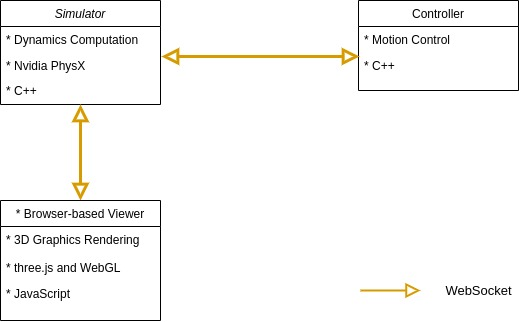

# Design Doc
**Status:**  Draft

**Authors:** [Yang Xia](https://github.com/Patrick233), [Le Li](https://github.com/LeLiPepsi)

## Context and Scope
Simulation is of essential importance in the field of robotics. We could easily develop and test the algorithms in a simulator first before we deploy everything on the physical robots, which is often less time-consuming and avoids destroying the robot because of the unintentional bugs.

**Goals:**

* Simulator with dynamics computation for any robots 
* Browser-based viewer for visualizing
* Example controllers
* Easy-to-use GUI to control the robots
* Support customized controller applications

**Non-goals:**

* Implementation of the physics engine
* Advanced 3D graphics rendering

## Overview

## Detailed Design
